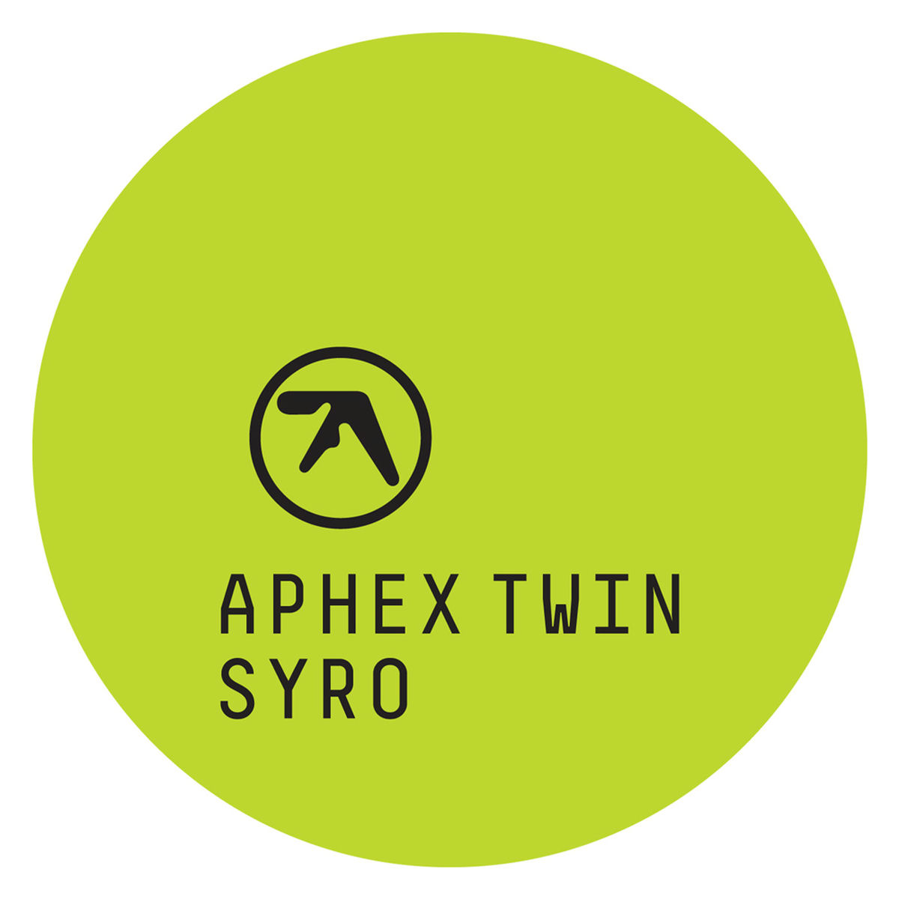

# Крипи-робот для гонок группы МТМО-26-3

Описание поэтапного процесса создания крипи-робота для участия в гонках группы МТМО-26-3: от сбора компонентов до финального заезда.

## Содержание

1. Состав робота
2. Сборка электрической части
3. Разработка формы и эскиз прототипа
4. Создание корпуса и его доработка
5. Сборка и испытания робота
6. Разработка дизайна корпуса и его воплощение
7. Результаты

---

## 1. Состав робота

В состав робота входят следующие компоненты:

- макетная плата;
- редуктор;
- диод;
- провода;
- кнопка включения питания;
- двигатель, совмещённый с редуктором.

## 2. Сборка электрической части

Вначале мы занялись пайкой пинов и проводов для некоторых компонентов к плате.

Далее мы перешли к сборке по схеме, чтобы двигатель был подключён в цепь параллельно.

## 3. Разработка формы и эскиз прототипа

После сборки схемы мы перешли к разработке дизайна прототипа. В работе мы следовали изначальной версии создания круглого корпуса, подобного советской игрушке "Попрыгунчик".

На следующем занятии мы создали эскиз нашего робота и приступили к моделированию корпуса.

## 4. Создание корпуса и его доработка

### 4.1. Материалы

Было принято решение делать корпус из картона: это лёгкий материал, с которым удобно работать с помощью ножниц и которому можно придать любую форму. Для сборки также использовались различные клейкие ленты (бумажная лента и изолента) и клеевой пистолет.

### 4.2. Круглая форма и размещение компонентов

После того как была создана круглая форма, в ней были проделаны отверстия под элементы так, чтобы они не касались корпуса.

Далее мы приступили к сборке. Важно было расположить компоненты так, чтобы они были сбалансированы по массе и скомпонованы для соблюдения круглой формы.

### 4.3. Вынесенная кнопка

Для удобства включения и выключения робота кнопка питания была вынесена на внешнюю часть корпуса. Для этого в одной из окружностей, служивших внешней частью корпуса, было сделано отверстие.

### 4.4. Движущиеся элементы

Движущиеся элементы были сделаны наиболее простым способом: из двух лопастей, согнутых под углом 90°. Они были прикреплены изолентой к детали, которая была выдана нам изначально.

### 4.5. Боковая стенка

После проклейки внутренних компонентов и добавления к ним боковых частей мы перешли к изготовлению боковой грани. Для определения её размера мы измерили длину окружностей, использованных в корпусе, и вырезали нужную полосу также из картона. Для неё мы подбирали менее плотный картон, чем для боковых частей.

С помощью линейки мы сделали несколько одинаковых сгибов по всей длине детали, чтобы её можно было подогнуть под круглую форму корпуса.

### 4.6. Склейка корпуса

Полученную боковую стенку мы приставили к корпусу так, чтобы свет от внутреннего диода выходил из предусмотренного отверстия, и склеили корпус с помощью бумажного скотча.

## 5. Сборка и испытания робота

После проклейки корпуса мы перешли к тестированию.

Испытания были проведены на макете гоночной трассы. Они прошли успешно: робот показал хорошую скорость и мобильность.

https://github.com/user-attachments/assets/84f1e633-e9bd-454c-b6c5-c3177b2b2700

## 6. Разработка дизайна корпуса и его воплощение

Поскольку у нас оставалось довольно много времени, мы перешли к дизайну робота. При выборе дизайна мы вдохновлялись альбомом музыканта Aphex Twin SYRO.

Мы решили покрасить робота в цвет этого альбома и перенести фирменный логотип Aphex Twin.

## 7. Результаты

После покраски робот был разобран до следующего занятия с целью извлечения аккумуляторной батареи.

На следующем занятии при повторной сборке была выявлена неизвестная проблема с нестабильной подачей питания. Проблема носила «плавающий» характер, и стабильную работоспособность робота восстановить до конца не удалось.

Тем не менее это не помешало нам участвовать в забеге. Несмотря на то что после самого первого заезда робот упал с высоты более 1 м, он хорошо себя показал и занял третье место среди групп. По нашим оценкам, если бы не падение после первого заезда, мы могли бы побороться за первое место.

